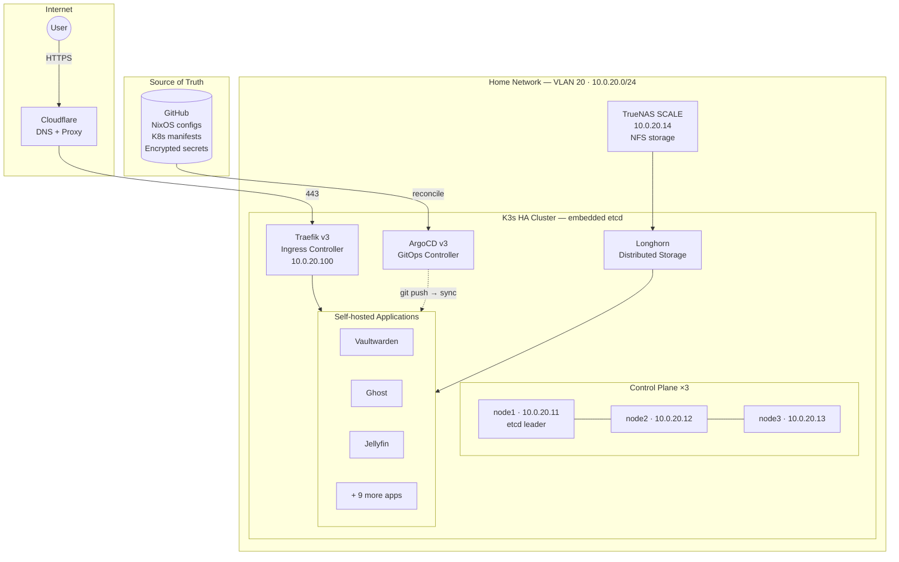

# David's Homelab

A production-grade bare-metal infrastructure project built for learning, self-hosting,
and demonstrating real-world engineering skills. Every node, every certificate, every
secret, and every deployment is managed entirely through code.

**Hardware**: 4× HP EliteDesk 800 G4 Mini — refurbished, silent, ~15–20W each
**Running cost**: ~€17/month (electricity + domain)
**Status**: Pre-deployment — all code ready, waiting on physical hardware

---

## Architecture



---

## Tech Stack

| Layer | Technology | Version | Purpose |
|---|---|---|---|
| **OS** | NixOS | 25.05 | Declarative, reproducible — entire OS in code |
| **Cluster** | K3s (embedded etcd) | nixos-25.05 | Lightweight HA Kubernetes, no external etcd |
| **GitOps** | ArgoCD | v3 (chart 7.8.0) | Self-healing — cluster always matches git |
| **Secrets** | sops-nix + age | follows nixpkgs | Secrets encrypted in git, zero secret server |
| **Ingress** | Traefik | v3 (chart 33.2.1) | Dynamic routing via Kubernetes CRDs |
| **Load balancer** | MetalLB | v0.15.3 | Bare-metal LoadBalancer IPs via L2 |
| **Storage** | Longhorn + TrueNAS NFS | 1.11.0 | Replicated block storage + NAS for media |
| **TLS** | cert-manager + Cloudflare | v1.20.0 | Automatic wildcard certs via DNS-01 |
| **Policy** | Kyverno | 3.4.0 | Mutation policies (NixOS PATH fix for Longhorn) |
| **Monitoring** | kube-prometheus-stack | 70.4.2 | Prometheus + Grafana + Alertmanager |

---

## Self-hosted Applications

| App | Subdomain | Purpose |
|---|---|---|
| Ghost | daviddelporte.com | Personal blog / website |
| Vaultwarden | vault.daviddelporte.com | Password manager (Bitwarden-compatible) |
| Jellyfin | jellyfin.daviddelporte.com | Media server |
| Jellyseerr | requests.daviddelporte.com | Media request management |
| RoMM | romm.daviddelporte.com | ROM / game library manager |
| Pelican | games.daviddelporte.com | Game server management |
| Actual Budget | budget.daviddelporte.com | Personal finance |
| SilverBullet | notes.daviddelporte.com | Personal knowledge base |
| Shelf | shelf.daviddelporte.com | Book tracking |
| Homepage | home.daviddelporte.com | Self-hosted dashboard (all apps in one place) |
| Uptime Kuma | status.daviddelporte.com | Uptime monitoring and public status page |
| Grafana | grafana.daviddelporte.com | Metrics, dashboards, and alerting |
| Longhorn UI | longhorn.daviddelporte.com | Storage management |
| ArgoCD | argocd.daviddelporte.com | GitOps deployment management |

---

## Cost at a glance

| | |
|--|--|
| **Hardware** | 4× HP EliteDesk 800 G4 Mini (refurbished) + storage |
| **Monthly running cost** | ~€17 (electricity + domain) |
| **Software** | 100% open source — €0 |
| **Cloud equivalent** | €80–200/month for the same workload |
| **Break-even vs cloud** | 6–12 months |

See [Hardware & Cost](hardware.md) for the full breakdown.

---

## Engineering Highlights

### Fully declarative infrastructure

Every node is defined in a NixOS flake. Provisioning a new bare-metal machine
is a single command — the script discovers hardware, generates cryptographic keys,
encrypts secrets for that specific node, installs NixOS, and verifies cluster
membership, all without touching the machine manually.

```bash
bash scripts/smart-deploy.sh 192.168.1.50 node1 server-init
```

### Secrets encrypted in git

All secrets (database passwords, API tokens, TLS credentials) are encrypted with
[age](https://age-encryption.org/) using sops. They live in the public repo as
encrypted blobs — readable only by machines whose keys are in `.sops.yaml`.
No secret server, no environment variables in CI, no risk of accidental exposure.

### Self-healing GitOps

ArgoCD monitors the git repo and continuously reconciles the cluster to match it.
If someone manually edits a resource, ArgoCD reverts it within minutes.
New apps are added by committing a Helm `Application` manifest — no `kubectl apply`
needed.

### Automatic rolling upgrades

```bash
bash scripts/upgrade-cluster.sh
```

Upgrades nodes one at a time (workers first, etcd leader last), verifies each
node is `Ready` before continuing, and rolls back automatically on failure.

---

## Why bare-metal over cloud?

| | Bare-metal homelab | Equivalent cloud |
|---|---|---|
| **Monthly cost** | ~€17 (electricity) | €80–200 |
| **Data sovereignty** | Full — nothing leaves home | Vendor-controlled |
| **Learning depth** | Hardware, OS, networking, K8s | Managed services only |
| **Vendor lock-in** | None | High |

The goal was to build something that mirrors production infrastructure — with
real failure modes, real networking constraints, and real operational runbooks —
not a managed service that abstracts all the interesting problems away.

---

## Documentation

| Guide | What it covers |
|---|---|
| [Deployment Guide](deployment-guide.md) | Boot to fully running cluster — step by step |
| [Node Provisioning](node-provisioning.md) | How smart-deploy.sh works, Ventoy USB setup |
| [Hardware & Cost](hardware.md) | Full bill of materials, running costs, sourcing guide |
| [Cert Manager TLS](cert-manager-tls.md) | DNS-01 setup, staging vs production, troubleshooting |
| [Alerting](alerting.md) | Alertmanager Discord webhook setup |
| [Gotchas](gotchas.md) | 14 hard-won lessons from building this |
| [Recovery](recovery.md) | Lost age key, corrupted etcd, full cluster rebuild |
| [Staging to Production](staging-to-prod.md) | TLS certificate promotion checklist |
| [Next Steps](next-steps.md) | Concrete deployment checklist with copy-paste commands |

---

## CI / CD Pipeline

Every push to `master` runs 5 automated checks:

| Check | What it validates |
|---|---|
| `nix flake check` | All NixOS configurations build without errors |
| `yamllint` | All YAML manifests pass linting |
| `kubeconform` | All Kubernetes manifests validate against API schemas |
| `sops-check + trufflehog` | No plaintext secrets committed |
| `line-endings` | LF only (CRLF breaks the Nix parser) |
