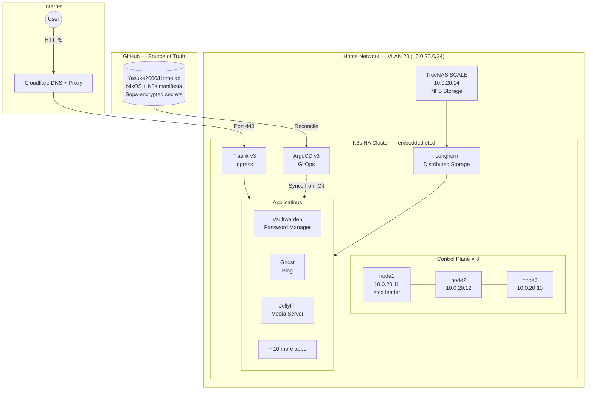

# David's Homelab

Sovereign bare-metal infrastructure running a **self-healing Kubernetes cluster**
on NixOS — fully declarative, GitOps-driven, zero manual configuration.

## Architecture



## Stack

| Layer | Technology | Why |
|---|---|---|
| OS | NixOS 25.05 | Fully declarative, reproducible, rollback on any change |
| Cluster | K3s (embedded etcd, HA) | Lightweight K8s, no external etcd dependency |
| GitOps | ArgoCD v3 | Self-healing — cluster always matches git state |
| Secrets | sops-nix + age | Secrets encrypted in git, no secret server needed |
| Ingress | Traefik v3 | Dynamic config via K8s CRDs |
| LoadBalancer | MetalLB v0.15 | Bare-metal LoadBalancer IPs on home network |
| Storage | Longhorn + TrueNAS NFS | Replicated block storage + NAS for media |
| TLS | cert-manager + Cloudflare DNS-01 | Automatic wildcard certs, works behind NAT |
| Monitoring | kube-prometheus-stack | Grafana + Alertmanager + Prometheus |

## Applications

| App | Purpose |
|---|---|
| Vaultwarden | Self-hosted password manager (Bitwarden compatible) |
| Ghost | Personal blog and writing platform |
| Jellyfin | Media server (films, series, music) |
| Jellyseerr | Media request management |
| RoMM | ROM manager for game library |
| Pelican | Game server management panel |
| Actual Budget | Personal finance / budgeting |
| Silverbullet | Personal knowledge base |
| Shelf | Book tracking |
| Homepage | Self-hosted dashboard |
| Grafana | Metrics and alerting |

## Key design decisions

**Why NixOS?** Every node is described in code. Rolling back a broken update is one
command. Adding a new node takes one script. The entire cluster state lives in git.

**Why not use a managed cloud?** Full control, zero vendor lock-in, data stays home.
Monthly cost: electricity. Compare to €50–150/month for equivalent cloud compute.

**Why sops + age instead of Vault?** No secret server to maintain. Secrets are
encrypted files in git, decryptable only by machines that have the private key.
Works offline, survives cluster rebuilds.

## Deployment

Everything is automated. Provisioning a bare-metal node:

```bash
# 1. Boot node from Ventoy USB (NixOS 25.05 minimal ISO)
# 2. Note the DHCP IP
# 3. From workstation:
nix develop
bash scripts/smart-deploy.sh 192.168.1.50 node1 server-init
```

The script discovers hardware, generates cryptographic keys, encrypts secrets
for the new node, deploys NixOS, and verifies cluster membership — fully unattended.
